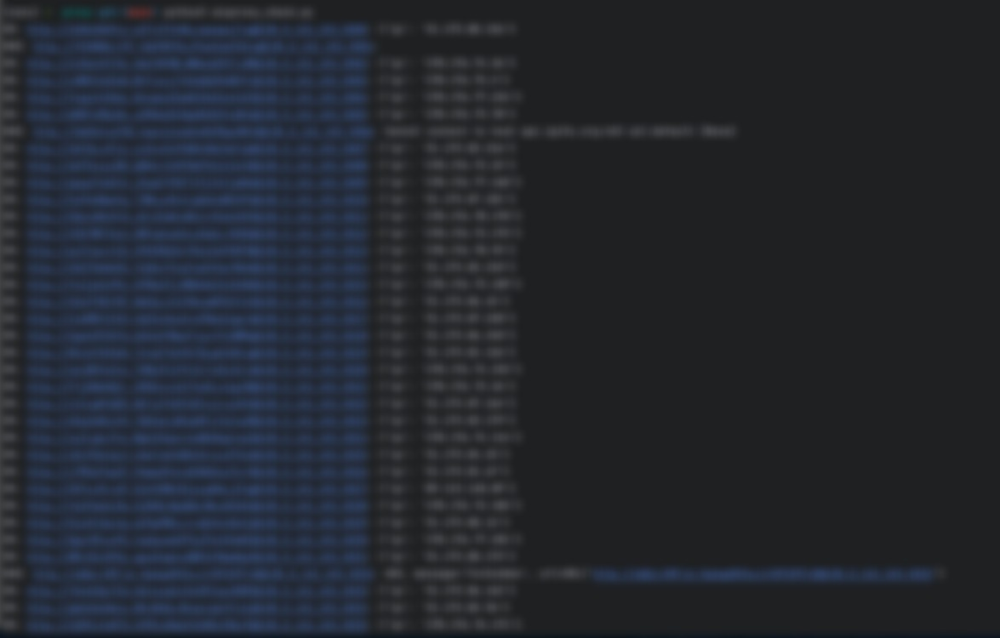
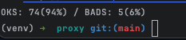

# aioproxy-check

Check Proxy List script with AsyncIO

### Usage:

> python3 aioproxy_check.py

(proxy list is in the proxy_list.txt file)

> python3 aioproxy_check_forwarded.py

(for forwarded proxies)

### Result:

