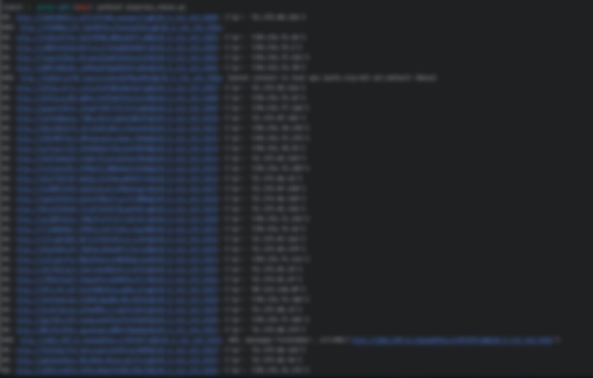

# aioproxy-check

Check Proxy List script with AsyncIO

## Install

> uv venv .venv --python 3.12

> source .venv/bin/activate

> uv pip install --python .venv/bin/python --upgrade -r requirements.txt

> python --version

## Usage

> python aioproxy_check.py my_proxies.txt

(proxy list file should be in `proxy/my_proxies.txt`)

> python aioproxy_check.py my_proxies.txt --proxy-type socks4

> python check_proxies.py my_proxies.txt

(extended checker, proxy list file should be in `proxy/my_proxies.txt`)

> python check_proxies.py my_proxies.txt --proxy-type socks5

(`--proxy-type`: `http` by default, or `socks4` / `socks5`; for lines without scheme script prepends selected type)

> python check_proxies.py my_proxies.txt --check-url https://api.myip.com

> python check_proxies.py my_proxies.txt --check-url https://api.ipify.org?format=json

(`--check-url`: proxy egress IP check service URL, default is `https://api.myip.com`)

> python check_proxies.py my_proxies.txt --max-concurrency 200 --retries 1 --retry-backoff 0.2

(`--max-concurrency`: limit simultaneous checks to avoid socket exhaustion, default `200`)

(`--retries`: additional retry attempts on transient network errors, default `1`)

(`--retry-backoff`: base delay in seconds between retries, default `0.2`)

> python check_proxies.py my_proxies.txt --iterations 3

> python aioproxy_check.py my_proxies.txt --iterations 3

(`--iterations`: number of check rounds, default is `1`)

> python aioproxy_check.py my_proxies.txt --check-url https://api.myip.com

> python check_proxies.py my_proxies.txt --resolve-location

> python check_proxies.py my_proxies.txt --no-resolve-location

(`--resolve-location`: enabled by default; when enabled, `ok_proxies_with_ip.txt` contains IP + country code, e.g. `1.2.3.4 (DE)`)

> python check_proxies.py my_proxies.txt --resolve-location --geo-max-concurrency 20 --geo-retries 3 --geo-retry-backoff 1 --geo-rps 5 --geo-cache-file geo_ip_cache.json

(`--geo-max-concurrency`: limit simultaneous geolocation requests, default `20`)

(`--geo-retries`: additional retries for geolocation requests, default `3`)

(`--geo-retry-backoff`: base delay in seconds for geo retries, default `1.0`)

(`--geo-rps`: throttle geolocation request rate; `0` disables throttling, default `5.0`)

(`--geo-cache-file`: local append-only JSON cache for resolved IP countries; reused between runs)

> python aioproxy_check.py my_proxies.txt --no-resolve-location

> python aioproxy_check_forwarded.py

(for forwarded proxies)

## Result

## Donates

